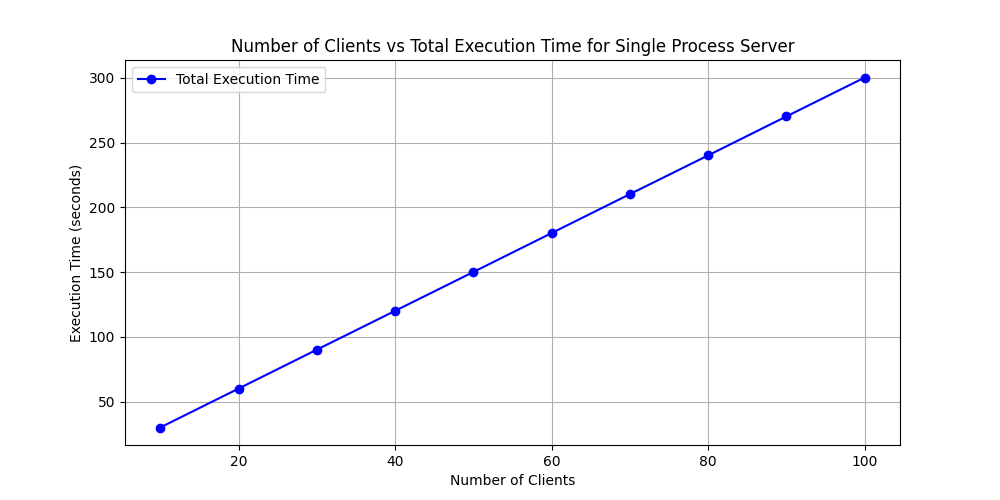
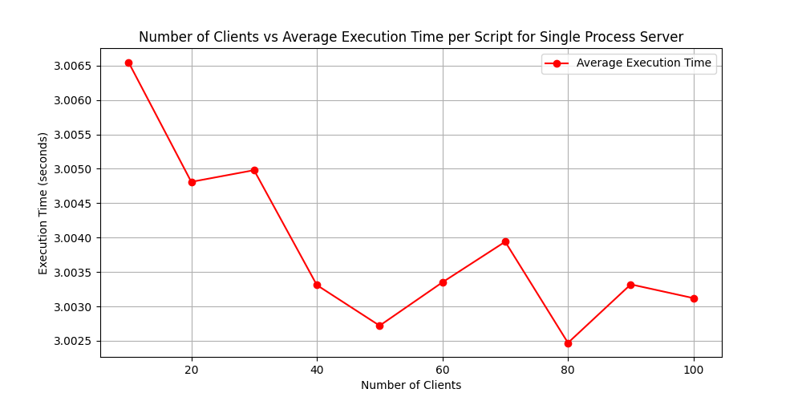
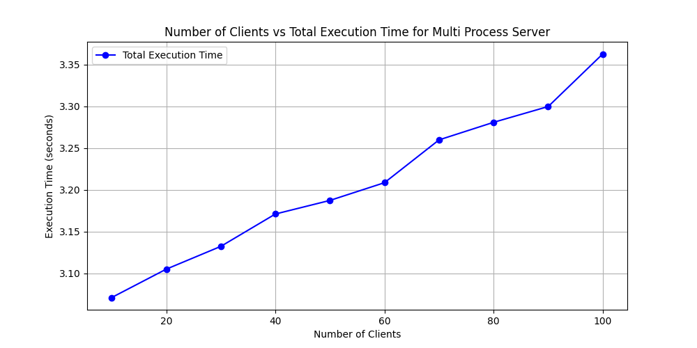
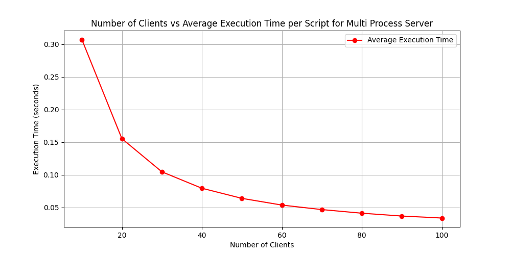

# Benchmarking Results  

## 1. Single-Process Single-Thread Server  

This server handles only one client at a time, meaning subsequent clients must wait for the current one to finish before being served.  

### Total Execution Time   

 **Observation**: The total execution time increases almost linearly, demonstrating the inefficiency of handling multiple clients in a single process.  

### Average Execution Time   

 **Observation**: The average execution time remains almost constant, showing very little fluctuations.  

---

## 2. Multi-Process Single-Thread Server  

In this model, the server spawns a separate process for each client, allowing multiple clients to be handled concurrently.  

### Execution Time  
  

 **Observation**: This approach significantly improves performance by reducing the total execution time, as multiple clients are processed in parallel.  

### Average Execution Time   

 **Observation**: The average execution time remains decreases almost exponentially.  
---

## 3. Multi-Threaded Server  

Here, the server creates a new thread for each client, allowing multiple clients to be handled simultaneously while sharing memory resources.  

### Execution Time   

 **Observation**: Similar to the multi-process model, this approach achieves very low total execution times while consuming fewer system resources than spawning multiple processes.  

### Average Execution Time   

 **Observation**: The average execution time remains decreases almost exponentially.   
---

## Conclusion
Multi-Thread Server yielded the best performance in terms of execution time.
